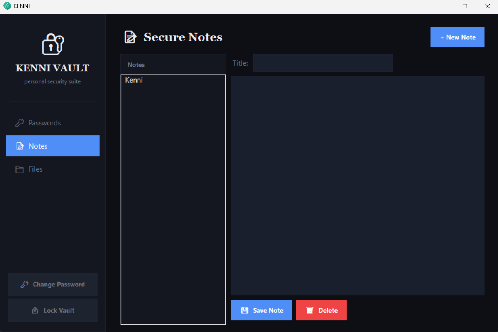
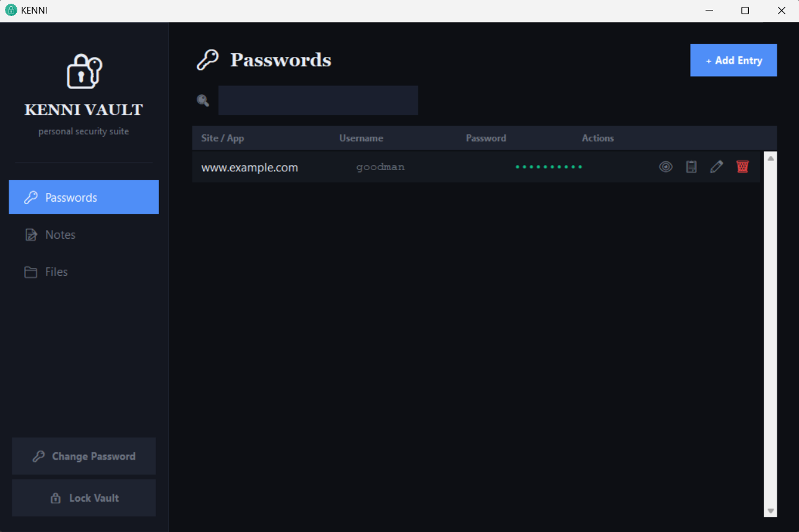
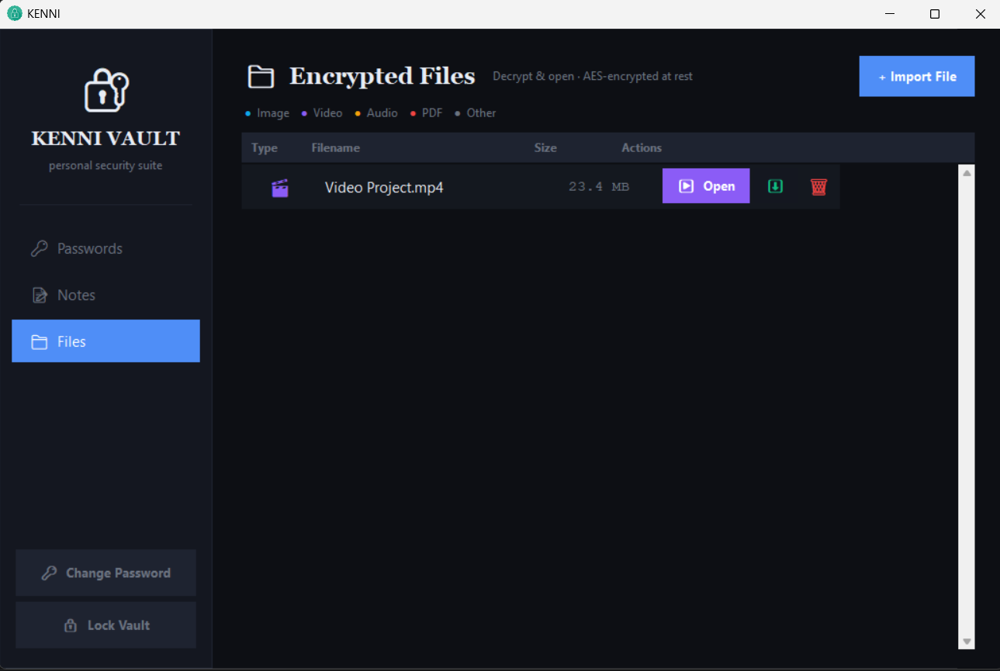

# 🔐 KENNI Vault

<p align="center">
  
</p>

<h3 align="center">A Modern Encrypted Personal Vault for Windows</h3>

<p align="center">
Store passwords, notes, documents, photos, videos, and audio files securely with strong encryption — completely offline.
</p>

<p align="center">
Built with Python, Tkinter, and Cryptography.
</p>

---

## 📖 About

KENNI Vault is a privacy-focused desktop application designed to provide a secure, all-in-one encrypted storage solution for Windows users.

While mobile platforms offer many vault applications, Windows lacks a dedicated desktop vault experience that combines secure file storage, password management, encrypted notes, and media protection under a single interface.

KENNI Vault was built to solve that problem.

All data remains local to your device and is encrypted at rest. No cloud services, no telemetry, and no third-party servers are involved.

---

## ✨ Features

### 🔐 Master Password Authentication

- Secure master password login
- PBKDF2-HMAC-SHA256 key derivation
- 480,000 iterations
- Strong password verification
- Maximum 5 failed login attempts
- Password change support

### 🔒 AES Encrypted Vault

- Fernet encryption
- AES-128-CBC encryption
- HMAC-SHA256 integrity protection
- Random cryptographic salt generation
- Encryption keys never stored on disk
- All vault data encrypted at rest

### 📁 Secure File Vault

Store and protect:

- Images
- Videos
- Audio files
- PDFs
- Documents
- Archives
- Any custom file format

Capabilities:

- One-click file import
- Automatic encryption
- Secure file opening
- File deletion
- File type detection
- Encrypted storage on disk

### 🔑 Password Manager

Store:

- Website credentials
- Application credentials
- Recovery codes
- Security questions
- Authentication notes

Features:

- Show / Hide passwords
- Copy credentials
- Edit entries
- Delete entries
- Encrypted password storage

### 📝 Secure Notes

- Create encrypted notes
- Store private information securely
- Local-only notebook
- Full vault encryption protection

### ⏳ Auto Lock Protection

- Automatically locks after 60 seconds of inactivity
- Manual vault lock button
- Clears sensitive session data
- Requires master password to unlock

### 🎨 Modern Desktop Interface

- Clean dark theme
- Sidebar navigation
- Fast and lightweight
- Organized dashboard
- Responsive desktop layout
- Simple user experience

---

## 🖼 Screenshots

### Dashboard



### Password Manager



### File Vault



---

## 🏛 Security Architecture

```text
Master Password
       │
       ▼
PBKDF2-HMAC-SHA256
(480,000 iterations)
       │
       ▼
Password Hash
       │
       ├──────────────► Verification
       │
       ▼
Derived Encryption Key
       │
       ▼
Fernet Encryption
(AES-128-CBC + HMAC-SHA256)
       │
       ▼
Encrypted Vault Data
```

### Vault File Structure

```text
vault.dat

[4 bytes]   Magic Header ("VLT1")
[32 bytes]  Salt
[64 bytes]  Password Hash
[N bytes]   Encrypted JSON Payload
```

### Security Principles

✅ Offline First

✅ No Cloud Storage

✅ No Telemetry

✅ No Tracking

✅ Local Encryption

✅ Memory-Only Encryption Keys

✅ Encrypted Files at Rest

✅ Strong Password Derivation

---

## 🏗 Technology Stack

| Component | Technology |
|------------|------------|
| Language | Python 3 |
| GUI Framework | Tkinter |
| Cryptography | cryptography |
| Key Derivation | PBKDF2-HMAC-SHA256 |
| Encryption | Fernet (AES-128-CBC + HMAC-SHA256) |
| Packaging | PyInstaller |
| Storage | Encrypted Local Storage |

---

## 📂 Project Structure

```text
vault_app/
│
├── main.py
├── login.py
├── vault_ui.py
├── encryption.py
├── storage.py
├── requirements.txt
├── vault_app.spec
│
└── data/
    ├── vault.dat
    └── encrypted_files/
```

---

## 🚀 Installation

### Clone Repository

```bash
git clone https://github.com/yourusername/kenni-vault.git
cd kenni-vault
```

### Install Dependencies

```bash
pip install -r requirements.txt
```

### Run Application

```bash
python main.py
```

---

## 🔰 First Launch

1. Create a master password (minimum 8 characters)
2. KENNI Vault automatically creates:

```text
data/
├── vault.dat
└── encrypted_files/
```

3. Begin storing passwords, notes, and files securely.

---

## 📦 Build Windows Executable

```bash
pip install pyinstaller
pyinstaller vault_app.spec
```

Output:

```text
dist/
└── VaultApp/
    └── VaultApp.exe
```

---

## 🔐 Data Storage

### Passwords

Stored inside the encrypted vault database.

### Notes

Stored as encrypted JSON data.

### Files

Stored inside:

```text
data/encrypted_files/
```

with encrypted filenames and encrypted content.

### Encryption Keys

- Derived from the master password
- Never written to disk
- Exist only during active sessions
- Destroyed when the vault locks or exits

---

## 🛣 Roadmap

### Version 2.0

- [ ] Drag & Drop Import
- [ ] File Search
- [ ] Tags & Categories
- [ ] Secure Image Viewer
- [ ] Integrated Video Player
- [ ] Integrated Audio Player
- [ ] Secure File Preview
- [ ] Backup & Restore Utility

### Future Releases

- [ ] Multiple Vault Support
- [ ] Portable Vault Mode
- [ ] Cross Platform Support
- [ ] Biometric Authentication
- [ ] Encrypted Backup Export
- [ ] Secure File Shredding

---

## 🤝 Contributing

Contributions are welcome.

1. Fork the repository
2. Create a feature branch
3. Commit changes
4. Push your branch
5. Open a Pull Request

---

## ⚠ Disclaimer

KENNI Vault is intended for personal and educational use.

While modern cryptographic practices are implemented throughout the project, users should always maintain backups of important encrypted data and use strong master passwords.

---


<p align="center">
Built with ❤️ using Python, Tkinter, and Cryptography.
</p>

<p align="center">
Privacy First • Offline First • Secure by Design
</p>
